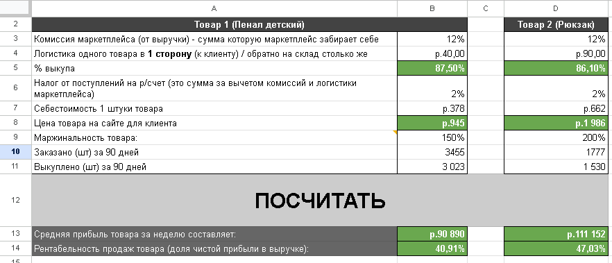

Анализ продаж с помощью Google Sheets
=================================

### *Тестовое задание по анализу продаж отдельных товаров*

См. результат на [гугл-диске](https://docs.google.com/spreadsheets/d/1yCAGs8wtZ-QYqUA1pfGp9B8bdRAOPLMH_ki82hVMGEA/edit?usp=sharing) или [в формате .xlsx](Mikhail_Karavaev_Test_task.xlsx)



## Задание

#### *Посчитать показатели продаж для отдельных товаров (пеналы, рюкзаки)*

При выполнении задания выявилась следующая неточность формулировки:  

показатель "Маржинальность товара" (строка 9 в таблице) имеет значения 150% и 200% для пеналов и рюкзаков соответственно, что невозможно, т.к. маржинальность в общепринятом [понимании](https://secrets.tinkoff.ru/biznes-s-nulya/marzha/) определяется как "отношение маржи к выручке".  

В свою очередь,  

> **Маржа = Выручка − Переменные расходы**  

Путем несложных математических действий (пример таких действий см.ниже) легко выяснить, что маржинальность(на рисунке обозначено Мн) не может быть выше 100% (это возможно только в случае, если переменные расходы (Пр) являются отрицательной величиной).  


Таким образом, под термином "маржинальность" явно подразумевалось что-то другое, судя по всему - наценка. Эта информация отражена в комментарии к ячейке A9 в таблице.  

Кроме того, на случай, если "Маржинальность" подразумевала получение "на руки" прибыли в виде указанного количества к себестоимости, были произведены дополнительные расчеты, отраженные в ячейках G7 и J7 для пеналов и рюкзаков соответственно, см. комментарии к ячейкам.  

  
  
    

Начинаем считать (примеры приведены для пеналов, в случае с рюкзаками делаем то же самое).

### **1. Процент выкупа товаров**  

Здесь всё просто: делим количество выкупленных товаров на количество заказанных и переводим в проценты:  

  

Формула:  

```dax

=B11/B10
```

То же самое - для рюкзаков.

### **2. Цена товара на сайте для клиента**

Для этого мы прибавляем к себестоимости товара процент "маржинальности". Таким образом, получается, что 
> **Цена на сайте = себестоимость * (1 + "маржинальность")**  

  

Формула:  

```dax

=B7*(1+B9)
```

Выше я указывал, что это не совсем правильный расчет, т.к. он не учитывает расходы. Поэтому, если мы хотим получить "на руки" 150% чистой прибыли, то считать следует по-другому. 
Ниже приведен расчет "на бумаге".  

  

  

Для того, чтобы получить 150% прибыли уже ПОСЛЕ оплаты всех комиссий и налогов, необходимо воспользоваться вышеприведенными расчетами.  

Вот как будет выглядеть формула:

  

  

```dax

=((B9+1)*B7/(1-B6)+B4)/(1-B3)
```

**Комментарий к формуле:**  

Продавец осуществляет следующие выплаты:  

* Комиссия маркетплейса от выручки - 12% (строка 3 таблицы);  

* Доставка товара в 1 сторону (там есть нюанс с возвратами, но сейчас для простоты не будем это учитывать) - 40 рублей (строка 4);  

* Налог от поступлений на р/счет (от суммы за вычетом комиссий и логистики маркетплейса) - 2% (строка 6).

Таким образом, если мы хотим получить маржу в сумме, эквивалентной проценту от себестоимости товара, мы должны сделать следующее:  

1. Прибавить к желаемому проценту 1;  

2. Умножить результат на себестоимость;  

3. Разделить результат, полученный в пункте 2, на (1 минус налог от поступлений на р/счет);  

4. Прибавить стоимость доставки; 

5. Разделить результат, полученный в предыдущем пункте, на (1 - комиссия маркетплейса).

Выглядит не очень понятно, поэтому проведем проверку, в которой повторим операции, совершаемые с суммой на площадке.  

**Проверка**

  

  

Мы будем искодить из следующей логики: 

> **Если из стоимости товара на сайте вычесть комиссию площадки и стоимость доставки, затем из получившейся суммы вычесть налог от пуступлений на р/счет и полученный результат разделить на себестоимость, то получится (желаемый процент + 1).**  

<br/>

1. Вычитаем из суммы товара для клиента (G7) 12 процентов (B3*G7);  

2. Вычитаем из получившегося значения стоимость доставки (B4);  

3. Вычитаем из получившегося результата 2 процента (G7-B3*G7-B4)*B6;  

4. Делим полученный результат на себестоимость (B7).  

Для пенала у нас получилось 2,5 - это и есть 150% плюс 1.

### 3. Средняя прибыль товара за неделю  

Для расчета данного показателя используется наиболее сложная формула в задании.  

  

  

```dax

=((B11*B8*(1-B3)-B4*B10-B4*(B10-B11))*(1-B6)-(B11*B7))/90*7
```

**Комментарий к формуле:**  

Для того, чтобы получить среднюю прибыль товара за неделю, необходимо:  

1. посчитать выручку;  

2. вычесть из нее все расходы;  

3. Посчитать среднюю прибыль за день (для этого необходимо разделить результат, полученный в предыдущем пункте, на 90 дней);  

4. посчитать среднюю прибыль за неделю (умножить результат предыдущего пункта на 7).  

Рассмотрим каждый пункт в отдельности.  

**1. Расчет выручки**  

Здесь всё просто: выручка в нашей модели считается путем умножения количества выкупленного товара на цену товара на сайте:  

```dax
B11*B8
```

**2. Расходы**  

Для того, чтобы посчитать расходы, необходимо учесть все комиссии и стоимость доставки. Следует обратить особое внимание на то, что если товар заказан, но не выкуплен, то придется платить и за доставку обратно на склад.

* Сначала вычитаем из выручки 12% комиссии:  

```dax

B11*B8*(1-B3)
```

* Затем вычитаем стоимость **заказанного** товара:  

```dax

B4*B10
```

* После этого вычитаем стоимость возврата на склад заказанного, но **не возвращенного** товара:  

```dax

B4*(B10-B11)
```

* Вычитаем налог от поступлений (или умножаем на (1 - налог)):  

```dax

(1-B6)
```  

* Вычитаем себестоимость товара:  

```dax

(B11*B7)
```

Пункты 3 и 4 (расчет средней прибыли за день и за неделю), ввиду простоты, приводить не будем.  

На всякий случай приведем формулу еще раз:  

```dax

=((B11*B8*(1-B3)-B4*B10-B4*(B10-B11))*(1-B6)-(B11*B7))/90*7
```  

<br/>


### 4. Рентабельность продаж товара ###

Рентабельность считается по формуле:  

> **Рентабельность = Прибыль / Выручка * 100%**  


  

Формула:  

```dax

=((B11*B8*(1-B3)-B4*B10-B4*(B10-B11))*(1-B6)-(B11*B7))/(B11*B8)
```
Как видим, здесь мы используем часть формулы из предыдущего пункта (прибыль за весь период).  

<br/>

  
Таким образом, мы разобрали такие ключевые показатели продаж как процент выкупа товара, среднюю прибыль товара за неделю и рентабельность продаж товара (долю чистой прибыли в выручке).

<br/>

**Спасибо за внимание!**  

С уважением. Михаил Караваев  

Своими пожеланиями, замечаниями и предложениями вы можете поделиться со мной по эл. почте karavaevms(at)gmail(dot)com, Telegram @karavaevms, а также [LinkedIn](https://www.linkedin.com/in/mikhail-karavaev/)


